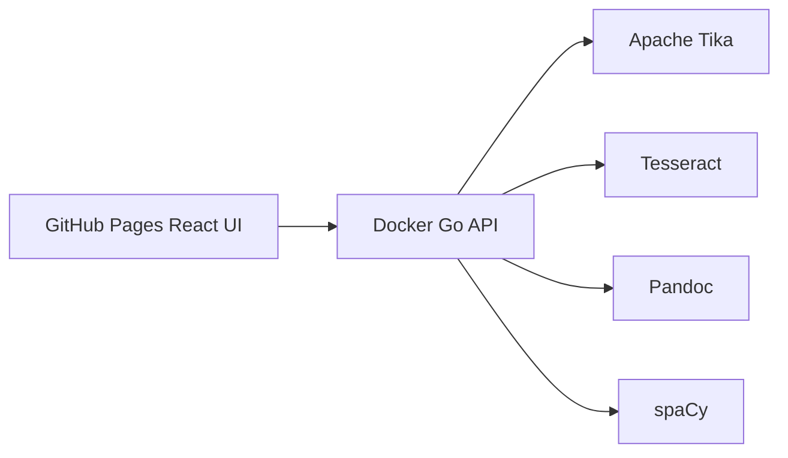

# Universal Document Workbench

Live site: https://baditaflorin.github.io/universal-document-workbench/

Repository: https://github.com/baditaflorin/universal-document-workbench

Support development: https://www.paypal.com/paypalme/florinbadita


Drop documents into a static GitHub Pages UI and process them through a Docker backend that extracts text and metadata, OCRs scans, detects entities, and exports Markdown, DOCX, and EPUB.

## Quickstart

```sh
make install-hooks
make dev
make test
make build
make smoke
```

## Backend

Run the local stub backend and frontend:

```sh
make dev
```

Run the full Docker backend:

```sh
docker compose -f deploy/docker-compose.yml -f deploy/docker-compose.dev.yml up -d
```

The frontend API URL can be changed in the GitHub Pages UI.

## Architecture

The frontend is hosted on GitHub Pages. The runtime document pipeline is a Dockerized Go API that orchestrates Apache Tika, Tesseract, Pandoc, and spaCy.



See `docs/architecture.md` and `docs/adr/`.

## Checks

```sh
make lint
make test
make build
make smoke
```

## Deployment

Frontend deploy guide:

docs/deploy.md

Backend deploy guide:

deploy/README.md

## Status

The v0.2.0 target adds the Phase 2 substance engine: document-shape inference, confidence, anomalies, provenance, deterministic IDs, actionable errors, and real-data fixture coverage. GitHub Pages is live, while the Docker backend is deployed separately.
