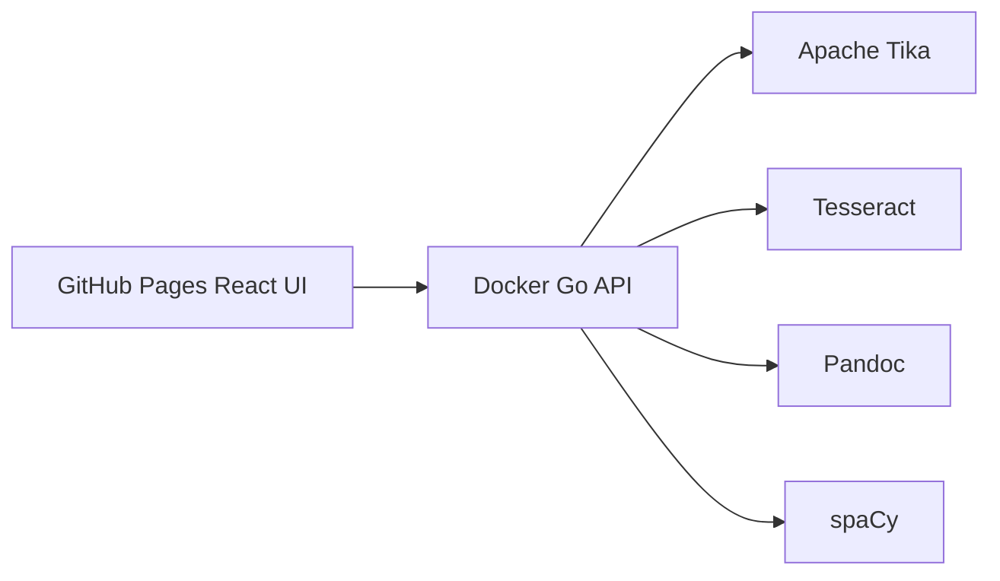

# Universal Document Workbench

Live site: https://baditaflorin.github.io/universal-document-workbench/

Repository: https://github.com/baditaflorin/universal-document-workbench

Support development: https://www.paypal.com/paypalme/florinbadita


Drop documents into a static GitHub Pages UI and process them through a Docker backend that extracts text and metadata, OCRs scans, detects entities, and exports Markdown, DOCX, and EPUB.

Phase 3 makes the public workbench behave like an actual tool instead of a one-file demo: upload or drag files, paste text or HTML, try the built-in sample, restore saved session state, copy text or JSON results, and keep working across reloads. The live page shows the running version and commit so users can see exactly what they are on before starring the repo or sending feedback.

## Quickstart

```sh
make install-hooks
make dev
make test
make build
make smoke
```

## Backend

Run the local stub backend and frontend:

```sh
make dev
```

Run the full Docker backend:

```sh
docker compose -f deploy/docker-compose.yml -f deploy/docker-compose.dev.yml up -d
```

The frontend API URL can be changed in the GitHub Pages UI.

## What You Can Do In The Live Workbench

- Upload one file or a batch of files
- Drag-drop documents directly onto the intake panel
- Paste raw text or HTML and process it through the same backend
- Load a sample document instantly
- Restore a saved workspace state JSON
- Copy extracted text or full result JSON
- Download Markdown, DOCX, EPUB, TXT, and state/result JSON outputs
- See the app version and commit directly in the page

## Architecture

The frontend is hosted on GitHub Pages. The runtime document pipeline is a Dockerized Go API that orchestrates Apache Tika, Tesseract, Pandoc, and spaCy.



See `docs/architecture.md` and `docs/adr/`.

Phase 3 audit trail:

- `docs/phase3/input-audit.md`
- `docs/phase3/output-audit.md`
- `docs/phase3/controls-audit.md`
- `docs/phase3/feature-claims-audit.md`
- `docs/phase3/codebase-audit.md`
- `docs/postmortem-phase3.md`

## Checks

```sh
make lint
make test
make build
make smoke
```

## Deployment

Frontend deploy guide:

docs/deploy.md

Backend deploy guide:

deploy/README.md

## Status

The `v0.3.0` target keeps the Phase 2 substance engine and adds the Phase 3 completeness pass: broader intake paths, session restore, state import/export, clipboard actions, recent-result history, and a workspace-first UI. GitHub Pages is live, while the Docker backend is deployed separately.

## Limitations

- Remote URL intake only works when the target host allows browser fetches.
- Folder ingestion and print-specific rendering are intentionally out of scope in this release.
