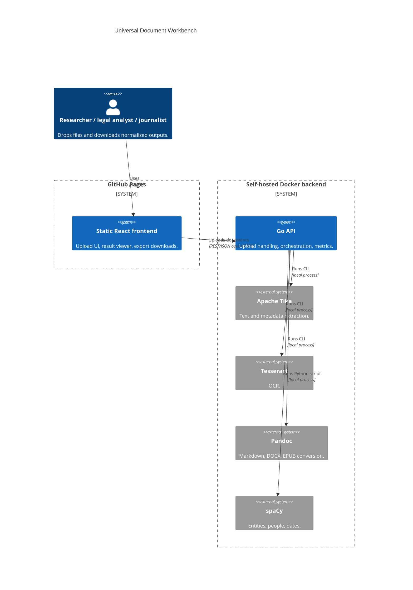
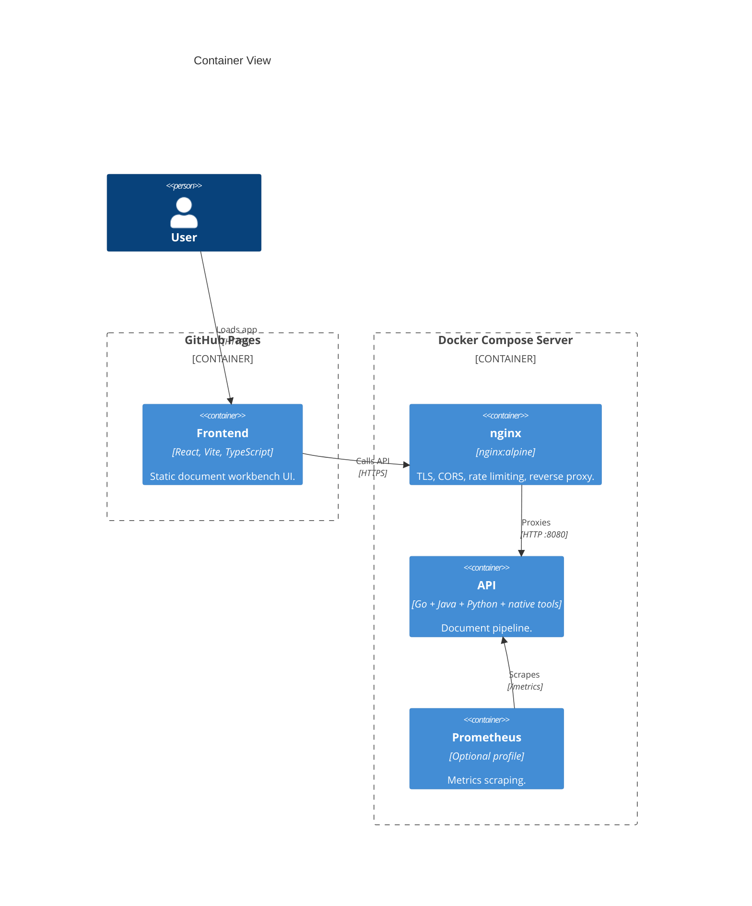

# Architecture

## Context

## Containers

## Module Boundaries

- `frontend/` owns the browser UI.
- `internal/httpapi/` owns HTTP routing and API responses.
- `internal/processor/` owns external tool execution and result assembly.
- `deploy/` owns production server topology.
- `docs/` owns GitHub Pages output and project documentation.

